# 机器学习模型选型指南：从入门到电石炉智能决策系统

> 本文从最基础的机器学习概念出发，逐步深入到工业场景下的模型选型与系统设计，适合没有机器学习背景的读者阅读。

---

## 一、什么是机器学习？从"预测房价"说起

想象你要预测一套房子的价格。你的第一个朋友（第 1 棵树）猜了一个价格，猜得不太准，差了一些。然后第二个朋友专门研究"第 1 个朋友哪里猜错了"，只盯着那些错误来修正……就这样一棵棵树叠加，每棵树都在"补上一届的作业"，最终预测越来越准。

这就是**梯度提升（Gradient Boosting）**的核心思想——机器学习中最重要的一类方法。

---

## 二、五种常见模型一览

在正式介绍 LightGBM 之前，先了解整个"家族谱"。

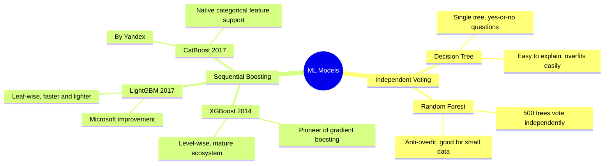

### 2.1 简单决策树——一个专家靠"是/否问题"做判断

一个老中介，靠经验一路问问题：「房子大于 100㎡ 吗？→ 是 → 学区房吗？→ 是 → 估价 200 万」。

- **优点**：结果一目了然，可以打印成流程图给老板看
- **缺点**：容易"背答案"——换一批新数据就翻车（过拟合）

### 2.2 随机森林——一群独立专家多数表决

你找了 500 个中介，每个人只随机看房子的一部分特征，各自独立给出估价，最后取平均。一个人猜错了没关系，500 人平均下来误差互相抵消。

**关键词**：独立、随机、投票——每棵树都是独立训练的，互相不交流，最后民主表决。

### 2.3 XGBoost——接力补错的鼻祖

2014 年出现的"初代梯度提升神器"。第一个中介估价，第二个专门研究第一个哪里错了……按层展开每棵树，老老实实一层一层来。

### 2.4 LightGBM——更聪明的接力补错

2017 年微软针对 XGBoost 的缺点做的改进版。区别在于：XGBoost 按层展开（每层横向展开所有节点），LightGBM 只挑**最值得分裂的那片叶子**去展开（聪明地选重点）。

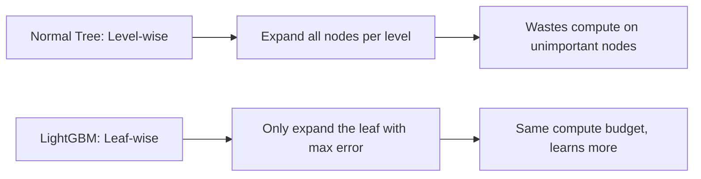

### 2.5 CatBoost——专治文字标签

同样是"接力补错"，但 CatBoost 特别擅长处理"城市名""房屋类型""装修风格"这类文字标签（类别特征）。其他算法遇到"上海"这个词需要你手动转成数字；CatBoost 原生支持，直接喂文字就行。

> **名字由来**：Cat = Categorical（类别），Boost = 提升。由俄罗斯 Yandex（相当于俄罗斯的百度）开发。

---

## 三、LightGBM 详解：一群"差生补课"的故事

### 3.1 梯度提升的核心过程

以预测房价为例，假设真实价格是 50 万：

| 轮次 | 这棵树做了什么 | 累计预测 | 剩余残差 |
|------|--------------|---------|---------|
| 第 1 棵树 | 根据特征猜了 30 万 | 30 万 | 20 万 |
| 第 2 棵树 | 专门预测"还差多少"，猜出 12 万 | 42 万 | 8 万 |
| 第 3 棵树 | 继续补残差，猜出 5 万 | 47 万 | 3 万 |
| … | … | … | … |
| 第 200 棵树 | 残差已极小 | 49.6 万 | 0.4 万 |

每一棵树都不去重新猜房价，它的任务只有一个：**预测上一轮所有树的残差**。

### 3.2 关键参数解释

```python
params = {
    "boosting_type": "gbdt",    # 使用梯度提升决策树
    "objective": "regression",  # 目标：做回归（预测数字）
    "metric": "mse",            # 用均方误差评估效果
    "learning_rate": 0.05,      # 学习速度，越小越稳但越慢
    "num_leaves": 31,           # 每棵树最多多少片叶子
    "early_stopping_round": 20, # 连续20轮没进步就提前停止
}
```

`learning_rate` 就像烤蛋糕的火候：设成 1.0 火太大容易糊（过拟合），设成 0.05 慢慢烤，最终口感更好。

### 3.3 模型评估指标

- **MSE（均方误差）**：预测值与真实值之差的平方平均，越小越好
- **RMSE（均方根误差）**：MSE 开根号，单位变回跟目标值一样，更直观
- **R²（决定系数）**：取值 0~1，越接近 1 说明模型解释力越强。R²=0.83 表示模型解释了 83% 的房价差异
- **MAPE（平均绝对百分比误差）**：预测值和真实值平均差多少个百分点，越小越好

---

## 四、选模型的决策框架

遇到新问题，可以按这个流程思考：

```mermaid
flowchart TD
    A["New prediction problem"] --> B{"Tabular data?"}
    B -- No --> C{"Image or text?"}
    C -- Image --> D["CNN"]
    C -- Text/Dialog --> E["Transformer / BERT"]
    B -- Yes --> F{"How much data?"}
    F -- "Dozens of rows" --> G["Random Forest<br/>anti-overfit by default"]
    F -- "Hundreds to millions" --> H{"Many categorical features?"}
    H -- Yes --> I["CatBoost<br/>no manual encoding needed"]
    H -- No --> J{"Speed vs ecosystem?"}
    J -- Speed first --> K["LightGBM"]
    J -- Rich community --> L["XGBoost"]
    F -- "Need full explainability" --> M["Simple Decision Tree<br/>printable flowchart"]
```

---

## 五、时序数据的处理：TCN 与 TimeMixer

当传感器采样频率很高（每秒多次），且历史规律非常复杂时，普通的手工构造滚动均值可能不够用，需要专门的时序模型来"自动提取时序规律"。

### 5.1 TCN（时序卷积网络）

TCN 使用**膨胀因果卷积**，每层卷积的间隔指数级增长（1→2→4→8…），用很少的层数就能覆盖很长的历史窗口。

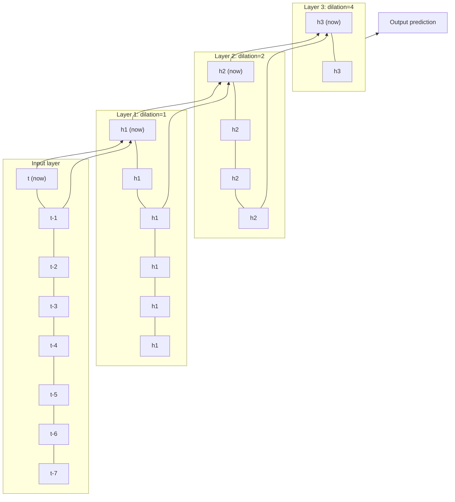

**因果卷积**保证了每个时刻只能看"过去"，不能看"未来"——这在工业决策系统里是铁律。

**TCN vs LSTM 对比**：

| 维度 | LSTM | TCN |
|------|------|-----|
| 比喻 | 边走边记笔记，只保留重要内容 | 把所有历史铺在桌上一次性扫描 |
| 并行计算 | 不支持（顺序处理） | 完全并行 |
| 长历史覆盖 | 容易遗忘太久以前 | 膨胀卷积高效覆盖 |
| 适合场景 | 短序列、资源有限 | 长序列、高频采样 |

### 5.2 TimeMixer（多尺度混合模型）

TimeMixer 是 2024 年 ICLR 发表的时序预测模型，核心思想是把同一段序列**按不同粗细同时复制多份**，分别学习各自的规律后混合。

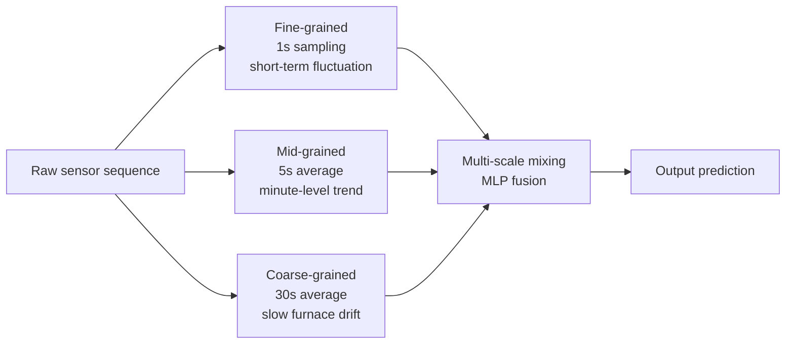

**为什么要分粗细？** 电石炉的电流信号同时包含两种规律：
- **短期波动**：电极位置微调带来的秒级抖动（细粒度才看得清）
- **慢速漂移**：炉料消耗导致的分钟级趋势变化（粗粒度才看得清）

把两种规律混在一起学，会互相干扰；分开学再融合，效果更好。

**TCN vs TimeMixer 对比**：

| 维度 | TCN | TimeMixer |
|------|-----|-----------|
| 核心机制 | 膨胀卷积，指数扩大感受野 | 多分辨率下采样，分层学习再混合 |
| 架构 | 卷积层 | 纯 MLP，无卷积无 Transformer |
| 擅长 | 捕捉局部时序模式 | 长短期预测，趋势+波动叠加的序列 |
| 复杂度 | 中等 | 较轻 |

---

## 六、电石炉智能决策系统：完整方案

### 6.1 业务背景

电石炉是一个巨大的工业电炉，用电流通过原料产生 2000°C 高温，把石灰和焦炭"煮"成电石（化工原料）。三根巨大的石墨电极（A/B/C 三相）从上往下插入炉内，电流通过它们加热原料。

核心优化目标：
- **功率因数 `power_factor`（↑）**：越高说明电能被有效利用的比例越大，目标区间 [0.92, 0.93]
- **吨电耗 `energy_per_ton`（↓）**：每生产 1 吨电石消耗的电量，正常约 2800~3300 kWh/t，越低越省钱

### 6.2 三层数据结构

系统将所有变量明确分为三层，形成一条清晰的因果链：

| 层级 | 字段 | 说明 |
|------|------|------|
| **驱动层** | `electrode_depth_a/b/c`、`electrode_speed_a/b/c`、`c_cao_ratio`、`lime_flow`、`coke_fixed_carbon` | 操作员可以直接控制的变量 |
| **中间状态层** | `current_a/b/c`、`short_net_impedance`、`imbalance`、`reaction_temp`、`furnace_pressure` | 由驱动层决定的电气和热工参数（模型一输出） |
| **结果指标层** | `power_factor`、`energy_per_ton` | 最终关心的经济/安全指标（模型二输出） |

### 6.3 中间状态层：7个指标详解

这 7 个指标是模型一的输出，也是模型二的输入，在因果链中起**承上启下**的作用。

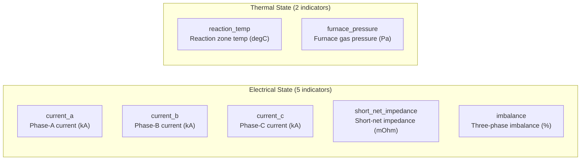

各指标的物理含义和正常范围：

| 编号 | 字段名 | 中文名 | 单位 | 正常范围 | 异常意味着 |
|------|--------|--------|------|---------|-----------|
| 1 | `current_a` | A 相电流 | kA | 100~140 | 电极深度偏离，火力不对 |
| 2 | `current_b` | B 相电流 | kA | 100~140 | 同上 |
| 3 | `current_c` | C 相电流 | kA | 100~140 | 同上 |
| 4 | `short_net_impedance` | 短网阻抗 | mΩ | — | 阻抗偏高则电能损耗增大 |
| 5 | `imbalance` | 三相不平衡度 | % | < 5% | 三根电极火力不均，损坏设备 |
| 6 | `reaction_temp` | 反应区温度 | °C | 1600~2000 | 偏低反应不充分，偏高浪费能量 |
| 7 | `furnace_pressure` | 炉内气相压力 | Pa | 80~200 | 偏低空气倒灌有爆炸风险 |

> **注意**：`current_a/b/c` 三相电流虽然是"中间状态"，但在模型训练时发现它们是预测功率因数最重要的特征（SHAP Top 3），验证了因果链设计的合理性。

### 6.4 两段因果模型架构

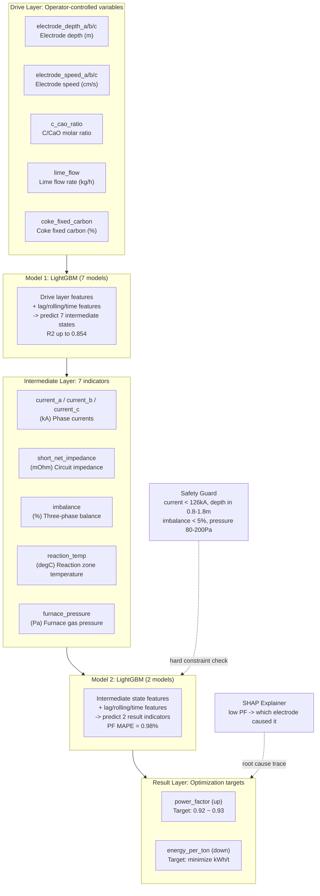

### 6.5 特征工程：三类时序特征

模型的输入不只是当前时刻的值，还包含三类历史信息：

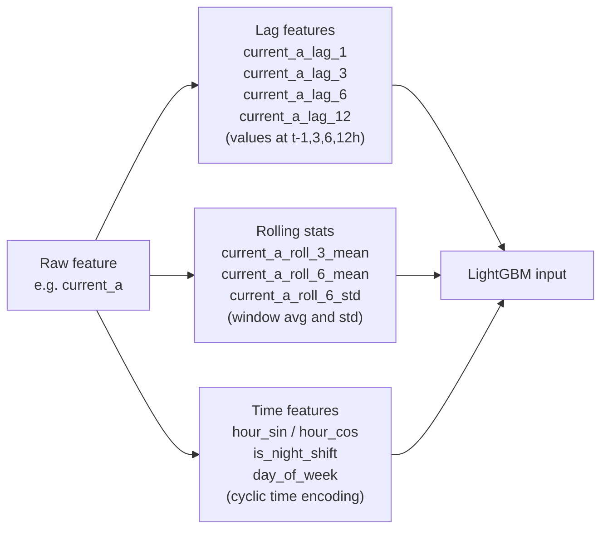

- **滞后特征**：告诉模型"过去几个小时发生了什么"，捕捉惯性
- **滚动统计**：告诉模型"最近一段时间稳不稳"，捕捉波动
- **时间特征**：告诉模型"现在是白班还是夜班"，捕捉班次规律

### 6.6 为什么两个模型都选 LightGBM？

**模型一（驱动层 → 7个中间状态）**：
- 工业传感器数据天生是结构化表格，LightGBM 的主场
- 特征之间有复杂非线性交互（"电极深度大 + 三相不均匀"才会导致高不平衡度），决策树天然能捕捉这种组合条件
- 与 SHAP 库的配合是工业界标准组合，可以直接告诉操作员"B 相压放量在过去 10 分钟偏低了"

**模型二（7个中间状态 → 功率因数 + 吨电耗）**：
- 含历史滞后和滚动均值的时序特征已经"预消化"了时序规律，直接给 LightGBM 用足够
- 功率因数预测 MAPE 仅 0.98%，实用精度良好
- 支持增量训练，可以随炉况漂移频繁重训，不需要重新设计网络结构

### 6.7 各算法在本场景的适用性总结

| 算法 | 在本场景的角色 | 适用度 |
|------|--------------|--------|
| LightGBM | 两段模型的核心预测器 | ★★★★★ 主选 |
| XGBoost | 可替代 LightGBM，但速度稍慢 | ★★★★☆ 备选 |
| CatBoost | 若有大量类别特征可考虑 | ★★★☆☆ 特定场景 |
| TCN | 作为高频序列特征提取前置层 | ★★★★☆ 进阶选项 |
| TimeMixer | 替代 TCN，在趋势+波动叠加的序列上更强 | ★★★★☆ 进阶选项 |
| 随机森林 | 数据极少时的保底选项 | ★★☆☆☆ 数据少时用 |
| 纯深度学习 | 黑盒，SHAP 解释差，不适合本场景 | ★☆☆☆☆ 不推荐 |

---

## 七、闭环决策系统：每 30 秒一次的五步循环

系统不依赖人工干预，每 30 秒自动执行一次决策循环：

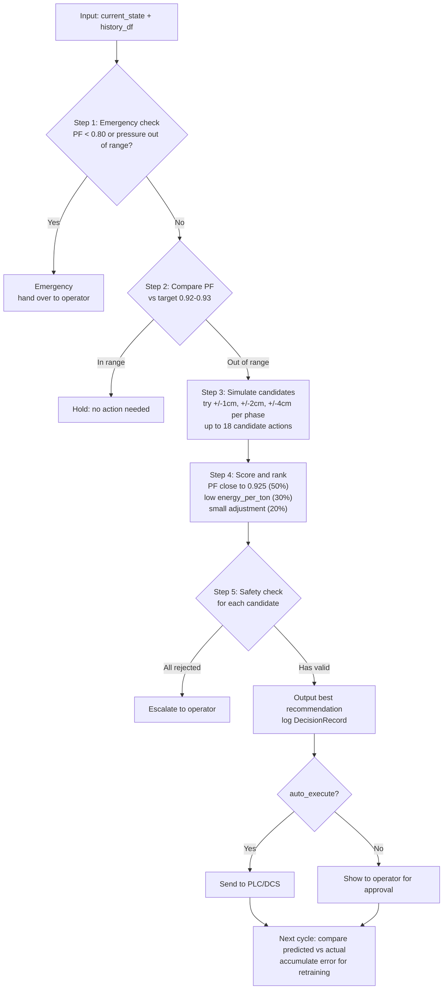

**安全守卫（完全独立于 AI）**的硬约束：

| 约束项 | 限制值 | 说明 |
|--------|--------|------|
| 电流上限 | ≤ 126 kA（额定 90%） | 防止过载 |
| 电极深度 | 0.8 ~ 1.8 m | 避免电弧闪烁和烧损顶炉 |
| 三相不平衡度 | < 5% | 超过会损坏设备 |
| 单次调节幅度 | < 5 cm | 防止突变 |
| 炉压 | 80 ~ 200 Pa | 防止空气倒灌和密封损坏 |
| 功率因数底线 | ≥ 0.80 | 低于此值紧急停机 |

---

## 八、进阶：加入时序模型的混搭方案

当传感器采样频率很高、数据量达到几十万行以上时，可以引入 TCN 或 TimeMixer 作为前置特征提取层：

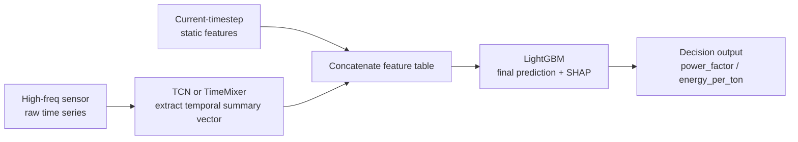

**何时引入时序模型？**

- 数据量 < 10 万行：继续用手工滚动均值 + LightGBM，简单够用
- 数据量 > 50 万行，采样频率 > 1 次/秒：考虑 TCN 或 TimeMixer 作为前置层
- 序列有明显的趋势+波动叠加（如炉温慢漂 + 电流快抖）：优先考虑 TimeMixer

---

## 九、总结

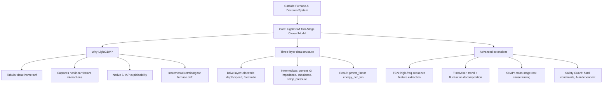

> **一句话总结**：对于电石炉这类工业场景，LightGBM 不是将就，而是真正适配。驱动层→7个中间状态→功率因数+吨电耗的三层因果链清晰、可解释、可追溯；安全守卫独立于 AI 之外兜底；时序模型（TCN / TimeMixer）是数据量充足时锦上添花的进阶选项。