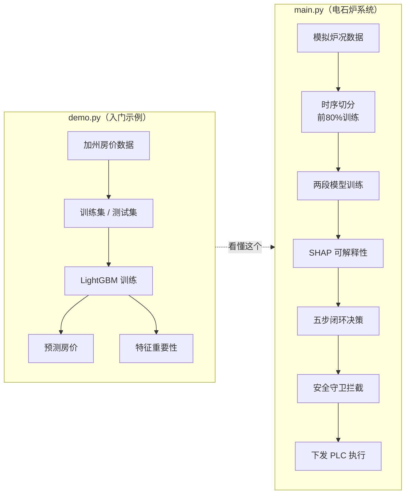
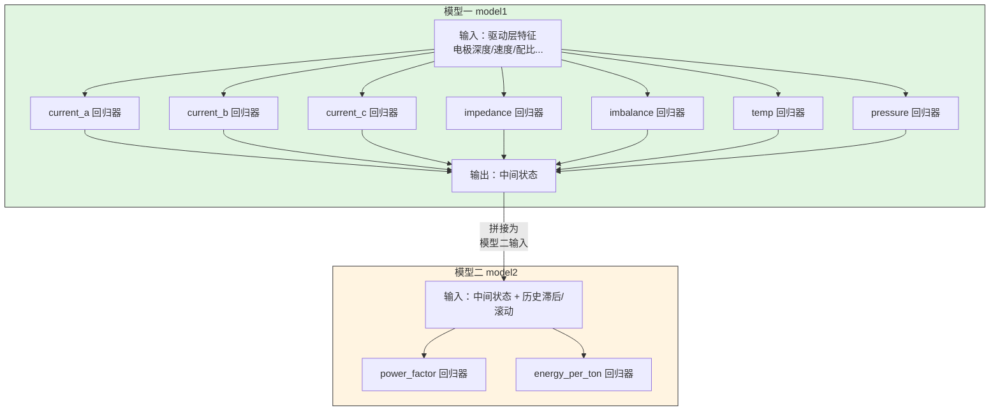
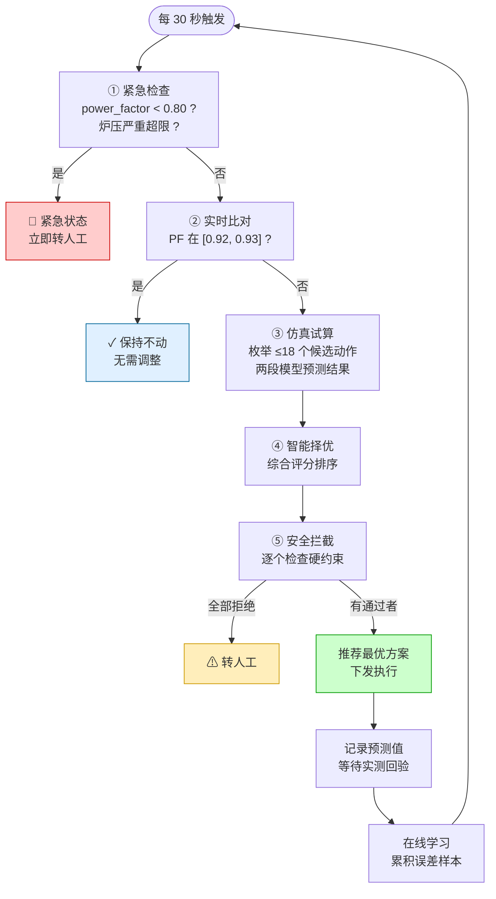
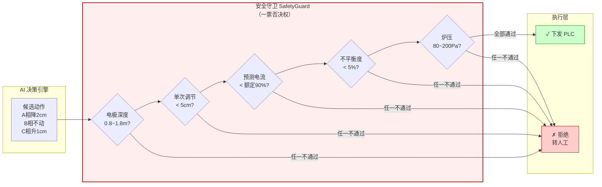
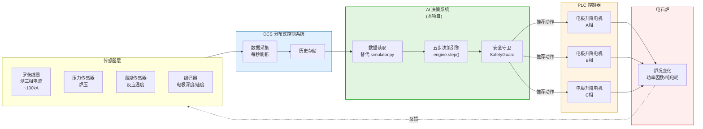

# 电石炉智能决策系统 —— 术语速查手册

> 如果你是第一次接触这个项目，或者对电石炉工艺/机器学习不太熟悉，请先阅读本文。文中所有术语都按**从简到繁**的顺序排列，并配有 `demo.py` 和 `main.py` 中的具体代码对应。

---

## 第一部分：从 `demo.py` 入门（极简机器学习示例）

`demo.py` 使用 **加州房价数据集** 演示了一个最基础的机器学习流程。它不涉及任何电石炉业务，目的是让你先熟悉核心 ML 概念。

### 1. LightGBM
**是什么**：一种基于梯度提升决策树（GBDT）的机器学习框架，特点是训练速度快、内存占用低、精度高。

**代码对应** (`demo.py` 第1行和第30-41行)：
```python
import lightgbm as lgb

params = {
    "boosting_type": "gbdt",   # 梯度提升决策树
    "objective": "regression", # 回归任务（预测连续数值）
    "learning_rate": 0.05,     # 学习率：每次迭代修正多少误差
    "num_leaves": 31,          # 每棵树的叶子数（控制复杂度）
}
model = lgb.train(params, lgb_train, num_boost_round=200)
```

> 💡 **通俗理解**：LightGBM 就像一群学生考试后互相批改卷子——第一个学生做一遍，第二个学生专门纠正第一个学生的错误，第三个学生纠正前两人的错误……最后把大家的答案加权平均，得到一个非常准的预测。

### 2. 训练集 / 测试集
**是什么**：把数据分成两部分，用训练集教模型学习规律，用测试集检验模型在"没见过的数据"上表现如何。

**代码对应** (`demo.py` 第22-24行)：
```python
X_train, X_test, y_train, y_test = train_test_split(
    X, y, test_size=0.2, random_state=42  # 20%数据留给测试
)
```

> ⚠️ **注意**：在 `main.py` 的电石炉项目中，**绝对不能随机打乱切分**（因为数据是时序的，随机打乱会导致"未来信息泄漏"）。电石炉项目采用按时间顺序切分：`前80%训练，后20%测试`。

### 3. 特征 (Feature) / 标签 (Label)
**是什么**：
- **特征 (X)**：模型用来做判断的输入信息。在房价数据里是"收入中位数、房龄、房间数"等。
- **标签 (y)**：模型要预测的答案。在房价数据里就是"房价"。

**代码对应** (`demo.py` 第10-11行)：
```python
X = pd.DataFrame(data.data, columns=data.feature_names)  # 特征
y = data.target  # 标签：房价（单位：10万美元）
```

### 4. 特征重要性 (Feature Importance)
**是什么**：训练完成后，模型告诉你"哪个输入因素对预测结果影响最大"。

**代码对应** (`demo.py` 第55-60行)：
```python
feature_importance = pd.DataFrame(
    {"feature": X.columns, "importance": model.feature_importance()}
).sort_values("importance", ascending=False)
```

> 💡 在电石炉项目中，特征重要性分析由 **SHAP** 完成（见后文）。

### 5. 回归 (Regression)
**是什么**：预测一个连续数值的任务（如房价、温度、功率因数）。与之相对的是**分类**（如判断是猫还是狗）。

本项目两个任务都是回归：
- 预测功率因数（0.80 ~ 0.98 之间的小数）
- 预测吨电耗（2800 ~ 3300 之间的整数）

---

## 附：`demo.py` vs `main.py` 流程对比



> 💡 `demo.py` 是一条**直线**：数据 → 训练 → 预测 → 完事。`main.py` 是一个**闭环**：数据 → 训练 → 决策 → 执行 → 收集反馈 → 再训练。

---

## 第二部分：`main.py` 业务术语详解

### 6. 电石炉 (Calcium Carbide Furnace)
**是什么**：一种大型工业电弧炉，通过电弧高温将生石灰（CaO）和焦炭（C）反应生成电石（CaC₂）。电石是生产聚氯乙烯（PVC）、乙炔等化工产品的重要原料。

**为什么需要 AI**：电石炉是典型的高耗能设备，功率因数和吨电耗直接影响生产成本。人工操作依赖经验，难以在 30 秒周期内做出最优决策。

### 7. 电极 (Electrode) —— A相、B相、C相
**是什么**：电石炉有三根巨大的石墨电极（对应三相交流电的 A、B、C 相），它们垂直插入炉料中，产生电弧提供反应所需的高温（约 1800~2200°C）。

**代码对应** (`main.py` 场景A，第136-138行)：
```python
"electrode_depth_a": 1.1,  # A相电极插入深度 1.1 米
"electrode_depth_b": 1.2,  # B相电极插入深度 1.2 米
"electrode_depth_c": 1.15, # C相电极插入深度 1.15 米
```

> 💡 **三相独立控制**是本系统的核心：AI 可以建议"A相降 2cm，B相不动，C相升 1cm"这样的精细操作。

### 8. 电极深度 / 插入深度 (Electrode Depth)
**单位**：米 (m)

**是什么**：电极插入炉料的深度。它是最关键的**可操作变量**——操作工（或 AI）可以通过升降电极来改变炉况。

**物理意义** (`data/simulator.py` 注释)：
- **插入太深** → 电流过大 → 可能烧损炉底、顶炉
- **插入太浅** → 电弧外露 → 闪烁、热量散失、功率因数下降
- **最优区间**：本项目设定为 0.8 ~ 1.8 米

**代码对应** (`data/simulator.py` 第37-42行)：
```python
# 电极插入深度（米），正常范围 0.8~1.8m，三相独立
df["electrode_depth_a"] = 1.2 + 0.3 * np.sin(...) + np.random.normal(0, 0.1, n_hours)
df[["electrode_depth_a", "electrode_depth_b", "electrode_depth_c"]] = df[...].clip(0.8, 1.8)
```

### 9. 功率因数 (Power Factor, PF)
**单位**：无量纲，范围 0~1

**是什么**：有功功率与视在功率的比值，衡量电能利用效率的指标。

**业务意义**：
- **越高越好**：PF = 1 表示电能完全转化为有用功；PF 低表示大量电能在电网和设备中无功循环，浪费严重。
- **目标区间**：本项目设定为 `[0.92, 0.93]`。这是电石炉运行的"甜蜜点"。
- **紧急底线**：低于 `0.80` 必须立即降负荷转人工，否则可能损坏电网设备。

**代码对应** (`engine/decision_engine.py` 第23-24行)：
```python
PF_TARGET_LOW = 0.92   # 目标下限
PF_TARGET_HIGH = 0.93  # 目标上限
```

**与电流的关系** (`data/simulator.py` 第99-106行)：
```python
# 倒U型曲线：在 optimal_current=120kA 附近功率因数最高
pf_base = 0.93 - ((avg_current - optimal_current) / 20) ** 2 * 0.1
# 三相不平衡度越大 → 功率因数越低
pf_base -= df["imbalance"] * 0.005
```

### 10. 吨电耗 (Energy per Ton)
**单位**：千瓦时/吨 (kWh/t)

**是什么**：生产一吨电石所消耗的电能。

**业务意义**：电石炉最大的成本就是电费。吨电耗每降低 10 kWh/t，对于一个年产 20 万吨的电石厂，一年可节省电费数百万元。

**代码对应** (`data/simulator.py` 第108-114行)：
```python
# 功率因数越高 → 电耗越低（理论下限2017，实际在2800~3200）
df["energy_per_ton"] = 3200 - (df["power_factor"] - 0.80) / 0.18 * 400
# 焦炭品质越好 → 电耗越低
df["energy_per_ton"] -= (df["coke_fixed_carbon"] - 80) * 10
```

### 11. 三相不平衡度 (Imbalance)
**单位**：百分比 (%)

**是什么**：A、B、C 三相电流（或电极深度）差异的量化指标。

**业务意义**：
- 正常值应 `< 5%`
- 超过 5% 会损坏变压器、缩短电极寿命
- 深度差异越大 → 不平衡度越大 → 功率因数越低

**代码对应** (`data/simulator.py` 第82-84行)：
```python
# 深度差异越大 → 不平衡越大
depth_std = df[["electrode_depth_a", "electrode_depth_b", "electrode_depth_c"]].std(axis=1)
df["imbalance"] = depth_std * 10 + np.random.exponential(0.5, n_hours)
```

### 12. 短网阻抗 (Short Net Impedance)
**单位**：毫欧 (mΩ)

**是什么**：从变压器二次侧到电极末端之间的导电回路（短网）对电流的阻碍作用。

**物理意义**：
- 与电极深度**负相关**——插得越深，短网阻抗越小
- 正常范围：1.5 ~ 3.0 mΩ
- 阻抗异常变化往往预示着电气故障

**代码对应** (`data/simulator.py` 第78-79行)：
```python
df["short_net_impedance"] = 2.5 - 0.3 * (avg_depth - 0.8) / (1.8 - 0.8) + np.random.normal(0, 0.1, n_hours)
```

### 13. 炉压 / 炉内气相压力 (Furnace Pressure)
**单位**：帕斯卡 (Pa)

**是什么**：电石炉密闭炉膛内气体的压力。

**业务意义** (`engine/safety_guard.py` 第32-33行注释)：
- **太低 (< 80 Pa)** → 空气倒灌，CO 与空气混合有**爆炸风险**
- **太高 (> 200 Pa)** → 密封损坏，有毒 CO 气体泄漏
- 正常范围：80 ~ 200 Pa

### 14. 原料配比 (C/CaO 摩尔比)
**是什么**：焦炭中碳与生石灰中氧化钙的摩尔比。

**正常范围**：2.9 ~ 3.2

**业务意义**：配比过高会浪费焦炭，过低会导致反应不完全、电耗升高。

**代码对应** (`data/simulator.py` 第50-51行)：
```python
df["c_cao_ratio"] = 3.05 + np.random.normal(0, 0.05, n_hours)
df["c_cao_ratio"] = df["c_cao_ratio"].clip(2.9, 3.2)
```

### 15. 焦炭固定碳含量 (Coke Fixed Carbon)
**单位**：百分比 (%)

**是什么**：焦炭中固定碳（有效反应成分）的含量。

**业务意义**：固定碳越高，反应效率越好，吨电耗越低。正常范围 80% ~ 90%。

### 16. 石灰流量 (Lime Flow)
**单位**：千克/小时 (kg/h)

**是什么**：生石灰原料的加入速率。

---

## 第三部分：`main.py` 技术架构术语

### 17. 三段因果链（驱动层 → 中间状态 → 结果指标）

这是本系统最核心的架构设计，**绝不能**压缩为单一模型：

```mermaid
flowchart LR
    subgraph drive["驱动层 Drive<br/>（可操作变量）"]
        D1["电极深度 A/B/C"]
        D2["电极速度"]
        D3["C/CaO 摩尔比"]
        D4["石灰流量"]
        D5["焦炭固定碳"]
    end

    subgraph inter["中间状态 Intermediate<br/>（电气参数）"]
        I1["三相电流"]
        I2["短网阻抗"]
        I3["三相不平衡度"]
        I4["反应温度"]
        I5["炉压"]
    end

    subgraph result["结果指标 Result<br/>（优化目标）"]
        R1["功率因数"]
        R2["吨电耗"]
    end

    drive -->|"模型一<br/>预测"| inter
    inter -->|"模型二<br/>预测"| result

    style drive fill:#e1f5e1,stroke:#333
    style inter fill:#fff4e1,stroke:#333
    style result fill:#ffe1e1,stroke:#333
```



| 层级 | 包含字段 | 说明 |
|------|---------|------|
| **驱动层** (Drive) | 电极深度、电极速度、C/CaO比、石灰流量、焦炭固定碳 | 人可以直接操作的变量 |
| **中间状态** (Intermediate) | 三相电流、短网阻抗、不平衡度、反应温度、炉压 | 驱动层的直接后果，电气参数 |
| **结果指标** (Result) | 功率因数、吨电耗 | 最终优化的目标 |

**代码对应** (`utils/feature_engineering.py` 第16-28行)：
```python
DRIVE_COLS = [
    "electrode_depth_a", "electrode_depth_b", "electrode_depth_c",
    "electrode_speed_a", "electrode_speed_b", "electrode_speed_c",
    "c_cao_ratio", "lime_flow", "coke_fixed_carbon",
]

INTERMEDIATE_COLS = [
    "current_a", "current_b", "current_c",
    "short_net_impedance", "imbalance",
    "reaction_temp", "furnace_pressure",
]

RESULT_COLS = ["power_factor", "energy_per_ton"]
```

> 💡 **为什么分两段？** 因为模型一承担"反事实仿真"职责：如果我把 A 相电极从 1.2m 降到 1.1m，电流会怎么变？如果模型一直接从驱动层跳到结果指标，你就无法解释"中间发生了什么"。

### 18. 两段模型 (Two-Stage Model)



**模型一** (`model1`)：驱动层特征 → 7 个中间状态目标（每个目标一个 LightGBM）
**模型二** (`model2`)：中间状态特征（含历史滞后/滚动） → `power_factor` + `energy_per_ton`（每个目标一个 LightGBM）

**代码对应** (`models/two_stage_model.py` 第69-105行)：
```python
def train(self, df, test_ratio=0.2):
    # 模型一：驱动层 → 中间状态
    X1, Y1 = build_features_for_model1(df)
    results1 = self._train_multi_output(X1, Y1, test_ratio, tag="模型一")
    
    # 模型二：中间状态 → 结果指标
    X2, Y2 = build_features_for_model2(df)
    results2 = self._train_multi_output(X2, Y2, test_ratio, tag="模型二")
```

### 19. 反事实仿真 (Counterfactual Simulation)
**是什么**："如果我把操作改成 X，结果会怎样？"

**在本项目中的应用**：决策引擎枚举候选动作（如"A相降 2cm"），用模型一预测新的电流/阻抗，再用模型二预测新的功率因数/电耗——这就是反事实仿真。

**代码对应** (`engine/decision_engine.py` 第287-335行的 `_predict_action` 方法)。

### 20. 特征工程 (Feature Engineering)
**是什么**：把原始数据加工成模型更容易理解的输入形式。

本项目有三类特征：

#### 20.1 滞后特征 (Lag Features)
**是什么**：用"上一个时刻的值"作为当前时刻的特征。

**例子**：`power_factor_lag_1` = 1 小时前的功率因数，`current_a_lag_3` = 3 小时前的 A 相电流。

**为什么重要**：炉况有惯性，过去 1~3 小时的状态对现在影响极大。

#### 20.2 滚动特征 (Rolling Features)
**是什么**：用"过去一段时间内的统计值"作为特征。

**例子**：`power_factor_roll_6_mean` = 过去 6 小时功率因数的平均值，`imbalance_roll_12_std` = 过去 12 小时不平衡度的标准差。

**代码对应** (`utils/feature_engineering.py` 第128-153行)：
```python
df[f"{col}_lag_{w}"] = df[col].shift(w)                  # 滞后
df[f"{col}_roll_{w}_mean"] = df[col].shift(1).rolling(w).mean()  # 滚动均值
df[f"{col}_roll_{w}_std"] = df[col].shift(1).rolling(w).std()    # 滚动标准差
```

**时间线示意**（以 `power_factor` 为例）：

```mermaid
gantt
    title 特征工程时间线示意（每小时一个采样点）
    dateFormat X
    axisFormat %s

    section 原始序列
    t-12          :a1, 0, 1
    t-11          :a2, 1, 2
    t-10          :a3, 2, 3
    t-9           :a4, 3, 4
    t-8           :a5, 4, 5
    t-7           :a6, 5, 6
    t-6           :a7, 6, 7
    t-5           :a8, 7, 8
    t-4           :a9, 8, 9
    t-3           :a10, 9, 10
    t-2           :a11, 10, 11
    t-1           :a12, 11, 12
    t (当前)      :a13, 12, 13

    section 滞后特征
    lag_1 (t-1)       :b1, 11, 12
    lag_3 (t-3)       :b2, 9, 10
    lag_6 (t-6)       :b3, 6, 7
    lag_12 (t-12)     :b4, 0, 1

    section 滚动特征
    roll_3_mean       :c1, 9, 12
    roll_6_mean       :c2, 6, 12
    roll_12_std       :c3, 0, 12
```



> 💡 **滞后特征**是"单点回头看"，`lag_3` 只看 `t-3` 那个时刻的值。**滚动特征**是"窗口统计"，`roll_6_mean` 看 `t-6` 到 `t-1` 这 6 个点的平均值。模型二同时用这两类特征，既知道"刚才发生了什么"，也知道"最近的趋势如何"。

#### 20.3 时间特征 (Time Features)
**是什么**：从时间戳中提取的周期性信息。

**代码对应** (`utils/feature_engineering.py` 第168-173行)：
```python
df["hour"] = ts.dt.hour               # 小时（0~23）
df["day_of_week"] = ts.dt.dayofweek   # 星期几（0=周一）
df["is_night_shift"] = ((ts.dt.hour >= 20) | (ts.dt.hour < 8)).astype(int)  # 是否夜班
df["hour_sin"] = np.sin(2 * np.pi * df["hour"] / 24)  # 让 0 点和 23 点在数学上相邻
```

### 21. 时序切分 (Temporal Split)
**是什么**：按时间顺序划分训练集和测试集，**不打乱**。

**为什么重要**：如果随机打乱，训练集会"偷看"到未来的数据，导致模型评估结果虚高，部署后失效。

**代码对应** (`models/two_stage_model.py` 第265-267行)：
```python
split_idx = int(len(X) * (1 - test_ratio))
X_train, X_test = X.iloc[:split_idx], X.iloc[split_idx:]  # 前80%训练，后20%测试
Y_train, Y_test = Y.iloc[:split_idx], Y.iloc[split_idx:]
```

### 22. SHAP (SHapley Additive exPlanations)
**是什么**：一种模型可解释性工具，告诉你"每个特征对这次预测贡献了多少"。

**在本项目中的作用**：回答操作工最关心的问题——"为什么 AI 建议降 A 相电极？" SHAP 分析会显示"A 相电流过高"或"近期功率因数偏低"是最关键原因。

**代码对应** (`models/two_stage_model.py` 第177-227行的 `get_shap_importance` 方法)：
```python
explainer = shap.TreeExplainer(model)
shap_values = explainer.shap_values(dummy_X)
importance = pd.DataFrame({
    "feature": feature_cols,
    "shap_importance": np.abs(shap_values).mean(axis=0),
})
```

### 23. 评估指标

#### 23.1 MAPE (Mean Absolute Percentage Error)
**公式**：平均绝对百分比误差 = `平均(|预测值 - 真实值| / 真实值)`

**代码对应** (`models/two_stage_model.py` 第289-291行)：
```python
"mape": round(mean_absolute_percentage_error(Y_test[col], y_pred) * 100, 2)
```

**业务意义**：`power_factor` 的 MAPE 约为 0.98%，意味着预测值与真实值平均只偏差不到 1%。

#### 23.2 MAE (Mean Absolute Error)
**公式**：平均绝对误差 = `平均(|预测值 - 真实值|)`

#### 23.3 R² (决定系数)
**公式**：1 表示完美预测，0 表示预测和瞎猜一样，负数表示比瞎猜还烂。

### 24. 闭环决策引擎 (Decision Engine)
**是什么**：每 30 秒执行一次的五步循环，是系统的"大脑"。



**五步流程** (`engine/decision_engine.py` 第84-189行)：

| 步骤 | 名称 | 说明 |
|------|------|------|
| ① | 紧急检查 | 功率因数 < 0.80 或炉压严重超限 → 立即转人工 |
| ② | 实时比对 | 当前 PF 在 `[0.92, 0.93]` → 保持不动 |
| ③ | 仿真试算 | 枚举 ≤ 18 个候选动作，用两段模型预测结果 |
| ④ | 智能择优 | 综合评分：PF 接近 0.925（50%）+ 吨电耗低（30%）+ 调节幅度小（20%） |
| ⑤ | 安全拦截 | 逐个检查候选动作，返回最优通过者，或全部拒绝则转人工 |

### 25. 候选动作 (Action Candidate)
**是什么**：AI 考虑的每一个具体操作方案。

**枚举策略** (`engine/decision_engine.py` 第221-285行)：
1. **单相微调**：每相 ±1/±2/±4 cm（精细调节）
2. **单相大步**：每相 ±8 cm（较大修正）
3. **三相联动**：所有相同时 ±4/±8/±12 cm（应对整体过深/过浅）

### 26. 安全守卫 (Safety Guard)
**是什么**：完全独立于 AI 模型的"安检门"。无论模型给出什么建议，都必须通过安全检查。



**核心原则** (`engine/safety_guard.py` 第4-6行注释)：
```python
# 核心原则：这个模块完全独立于AI模型。
# 无论AI给出什么建议，都必须先过这里的"安检门"。
# 任何一项不过，建议直接拒绝，交给人工。
```

**检查项** (`engine/safety_guard.py` 第12-40行的 `SafetyLimits`)：

| 约束项 | 限制值 | 违规后果 |
|--------|--------|----------|
| 电流上限 | 额定值的 90% | 变压器过载烧毁 |
| 电极深度 | 0.8 ~ 1.8 m | 电弧闪烁 / 烧损顶炉 |
| 三相不平衡度 | < 5% | 设备损坏 |
| 单次调节幅度 | < 5 cm（演示可放宽到 12cm）| 炉况剧烈波动 |
| 炉压 | 80 ~ 200 Pa | 空气倒灌爆炸 / 密封损坏 |
| 功率因数紧急底线 | ≥ 0.80 | 电网无功冲击 |

### 27. DCS / PLC / 罗茨线圈



**DCS** (Distributed Control System，分布式控制系统)：工厂里的中央监控计算机，采集所有传感器数据。

**PLC** (Programmable Logic Controller，可编程逻辑控制器)：现场的工业控制器，直接驱动电极升降电机。

**罗茨线圈** (Rogowski Coil)：一种测量大电流的非接触式传感器，用于测量电石炉的三相电流（可达 100kA 以上）。

**部署关系** (`AGENTS.md` 部署替换清单)：
- 现在：`data/simulator.py` 生成假数据
- 真实部署：用罗茨线圈测电流 → DCS 采集数据 → AI 系统决策 → 通过 PLC 下发电极升降指令

### 28. 在线学习 (Online Learning)
**是什么**：模型部署后，持续收集"预测值 vs 实测值"的误差数据，定期用新数据重新训练模型，使其适应炉况漂移。

**代码对应** (`engine/decision_engine.py` 第191-204行)：
```python
def record_actual_result(self, record: DecisionRecord, actual_pf: float):
    record.actual_pf = actual_pf
    record.prediction_error = abs(record.predicted_pf - actual_pf)
    # 这个误差数据会作为在线学习的反馈样本
```

---

## 第四部分：快速对照表

| 术语 | 英文 | 出现在哪个文件 | 一句话解释 |
|------|------|---------------|-----------|
| 电石炉 | Calcium Carbide Furnace | `data/simulator.py` | 用电弧高温生产电石的大型工业炉 |
| 电极 | Electrode | `main.py` 场景A-E | 产生电弧的三根大碳棒，A/B/C 三相各一根 |
| 电极深度 | Electrode Depth | `data/simulator.py` | 电极插入炉料的深度，核心操作变量 |
| 功率因数 | Power Factor |  everywhere | 电能利用效率，目标 `[0.92, 0.93]` |
| 吨电耗 | Energy per Ton | `data/simulator.py` | 生产一吨电石用多少电，越低越好 |
| 三相不平衡度 | Imbalance | `data/simulator.py` | 三相电流/深度差异，应 `< 5%` |
| 短网阻抗 | Short Net Impedance | `data/simulator.py` | 变压器到电极的回路电阻，1.5~3.0 mΩ |
| 炉压 | Furnace Pressure | `engine/safety_guard.py` | 炉内气压，80~200 Pa，超限有爆炸风险 |
| LightGBM | Light Gradient Boosting Machine | `demo.py`, `models/two_stage_model.py` | 快速、低内存的梯度提升决策树框架 |
| 两段模型 | Two-Stage Model | `models/two_stage_model.py` | 模型一：驱动→中间状态；模型二：中间状态→结果 |
| 反事实仿真 | Counterfactual Simulation | `engine/decision_engine.py` | "如果我这样操作，结果会怎样？" |
| SHAP | SHapley Additive exPlanations | `models/two_stage_model.py` | 解释每个特征对预测结果的贡献 |
| 滞后特征 | Lag Feature | `utils/feature_engineering.py` | 用过去某时刻的值作为当前特征 |
| 滚动特征 | Rolling Feature | `utils/feature_engineering.py` | 用过去一段时间的平均/标准差作为特征 |
| 时序切分 | Temporal Split | `models/two_stage_model.py` | 按时间顺序分训练/测试集，禁止随机打乱 |
| 闭环决策 | Closed-Loop Decision | `engine/decision_engine.py` | 每 30 秒自动执行的五步决策循环 |
| 安全守卫 | Safety Guard | `engine/safety_guard.py` | 独立于 AI 的硬约束检查，拥有一票否决权 |
| 在线学习 | Online Learning | `engine/decision_engine.py` | 用实际运行数据持续改进模型 |

---

## 推荐阅读顺序

1. **先看 `demo.py`**：理解 LightGBM 如何训练、预测、评估（加州房价数据很直观）。
2. **再看 `data/simulator.py`**：理解三层数据是怎么生成的，每个字段的物理意义。
3. **然后看 `main.py` 的 Step 1-4**：理解数据 → 训练 → SHAP → 保存的流程。
4. **最后看 `main.py` 的 Step 5**：理解五个典型场景的决策行为（偏低→调整、区间内→保持、紧急→转人工）。
5. **深入时**：阅读 `engine/decision_engine.py` 和 `engine/safety_guard.py`，理解五步循环和安全拦截的细节。
