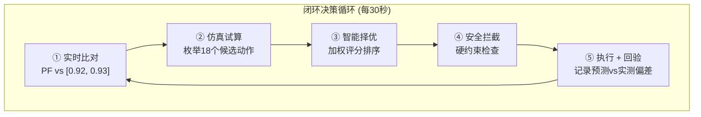
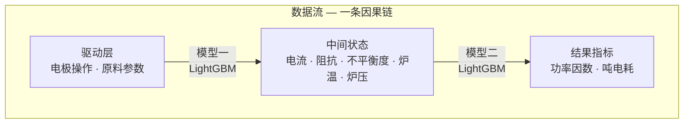
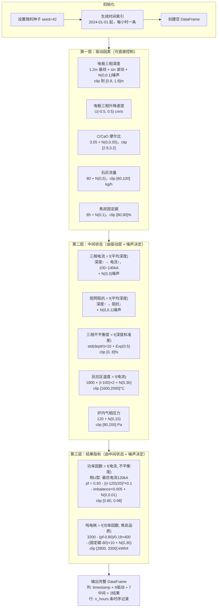
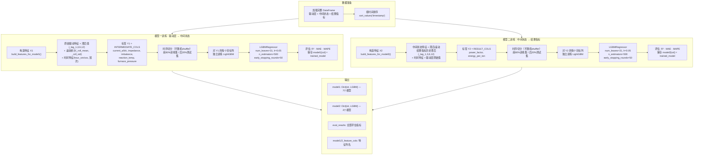
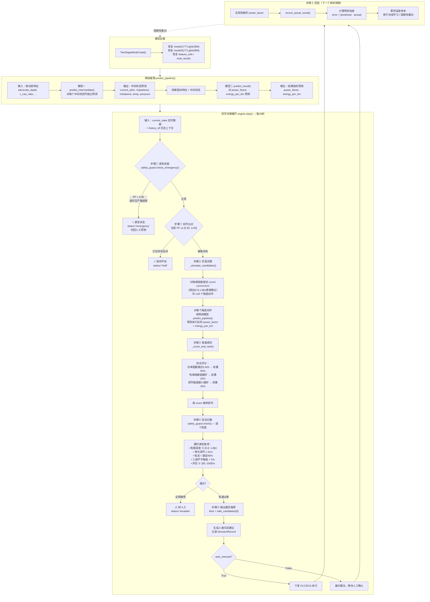
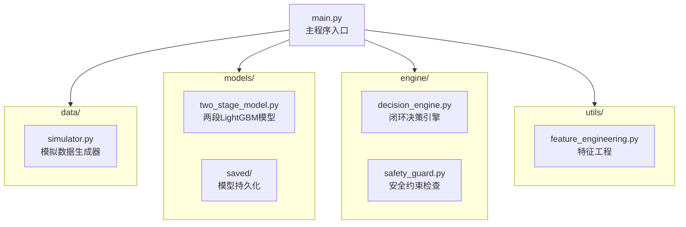

# 电石炉电极操作智能决策系统

基于 LightGBM 两段因果模型 + SHAP 可解释性 + 安全约束防护的闭环决策系统。

## 架构总览





### 三层数据结构

| 层级 | 字段 | 说明 |
|------|------|------|
| **驱动层** | `electrode_depth_{a,b,c}`, `electrode_speed_{a,b,c}`, `c_cao_ratio`, `lime_flow`, `coke_fixed_carbon` | 可直接控制的变量 |
| **中间状态** | `current_{a,b,c}`, `short_net_impedance`, `imbalance`, `reaction_temp`, `furnace_pressure` | 电气参数和炉况（模型一输出） |
| **结果指标** | `power_factor`, `energy_per_ton` | 最终关心的经济/安全指标（模型二输出） |

## 小白入门：术语通俗解释

如果你刚接触工业 AI 或者对电石炉不熟悉，这一节用**生活中的比喻**帮你快速理解每个术语。

---

### 场景比喻：把电石炉想象成一口"智能高压锅"

> 你正在用高压锅炖一锅牛肉。火太小 → 炖不烂；火太大 → 糊锅；火不稳 → 半生不熟。
> 电石炉比高压锅大一万倍，温度高达 2000°C，但面临的问题本质一样：**怎么把"火候"控制在最佳状态？**

---

### 设备相关

| 术语 | 小白解释 |
|------|----------|
| **电石炉** | 一个巨大的工业电炉，用电流通过原料产生 2000°C 高温，把石灰和焦炭"煮"成电石（化工原料）。你可以理解为一口三层楼高的"电磁炉火锅"。 |
| **电极**（electrode） | 三根巨大的石墨柱子，从上往下插入炉内，电流通过它们加热原料。**比喻**：就像你把三根金属筷子插进火锅里通电加热——筷子插得越深，电流越大，温度越高。共有 A、B、C 三相。 |
| **三相电流** | 三根电极各自通的电流大小（单位：千安培 kA）。正常约 100~140 kA。**比喻**：就像三根筷子上各自通过的"火力"，最好三根火力均匀。 |
| **原料** | 石灰（CaO）和焦炭（C）。**比喻**：火锅底料和食材。比例不对，味道就差。 |

### 状态相关

| 术语 | 小白解释 |
|------|----------|
| **功率因数**（Power Factor, PF） | **最核心的指标！** 衡量电能被"有效利用"的比例，范围 0~1。1.0 = 完美利用，0.8 = 浪费了20%的电。**比喻**：就像你花100块钱买食材，最后吃到嘴里的只有80块的价值——功率因数就是"吃到嘴里的比例"。目标区间 [0.92, 0.93]。 |
| **吨电耗**（energy_per_ton） | 生产一吨电石要消耗多少度电（kWh/t）。正常约 2800~3300。**比喻**：就像汽车的百公里油耗——越低越省钱。这是老板最关心的数字。 |
| **三相不平衡度**（imbalance） | 三根电极电流不一致的程度。**比喻**：三个人抬轿子，有人出力多有人出力少——不仅不稳，还容易"闪了腰"（损坏设备）。要控制在 5% 以内。 |
| **短网阻抗**（short_net_impedance） | 从变压器到电极这段"电线"的电阻。阻抗越小，电损耗越低。**比喻**：就像水管的粗细——粗管子水流顺畅，细管子水压损失大。 |
| **反应区温度**（reaction_temp） | 炉内发生化学反应区域的温度，约 1600~2000°C。太低反应不充分，太高浪费能量还可能损坏炉子。 |
| **炉内气相压力**（furnace_pressure） | 炉子里的气体压力（单位 Pa）。**比喻**：就像高压锅的气压——太低空气倒灌有爆炸风险，太高会损坏密封。 |

### AI / 机器学习相关

| 术语 | 小白解释 |
|------|----------|
| **模型** | 一个能从历史数据中"学到规律"的数学函数。你给它输入，它给你输出。**比喻**：就像你请了一个老厨师，告诉他"以前 1000 次做了什么操作 → 出了什么结果"，他就能预测"下次你这样操作会出什么结果"。 |
| **LightGBM** | 一种**决策树集成算法**，特点是训练快、内存小、精度高。**比喻**：不是请一个专家，而是请 500 个普通人各自给出判断，然后综合投票——结果往往比单一专家更准。本系统用它来模拟"操作 → 结果"的因果链。 |
| **SHAP** | 一个**解释器**，告诉你"模型的预测是依据哪些因素做出的"。**比喻**：你问老厨师"为什么建议火开大一点？"他回答："因为当前温度偏低（占 40%）、原料湿度大（占 30%）、上次小火效果不好（占 20%）……"SHAP 就是让 AI 模型也能给出这样的解释。 |
| **特征工程** | 把原始数据"打扮"成模型更容易理解的形式。**比喻**：超市小票是原始数据，你把它整理成"每周蔬菜支出趋势图"就是特征工程。本系统主要做三件事：① 加上历史记录（滞后特征）② 计算近期波动（滚动统计）③ 标注时间规律（班次/星期几）。 |
| **训练 / 推理** | 训练 = 用历史数据"教"模型（像老师用练习册教学生）。推理 = 训练好的模型做预测（像学生考试做题）。**比喻**：训练是你给厨师 1000 份菜谱和评分让他学习；推理是你告诉他原料，让他预测好不好吃。 |
| **R²**（R方） | 衡量预测有多准的指标。0 = 瞎猜，0.5 = 有点准，0.8+ = 很准，1.0 = 百分百准确（现实中不可能）。**比喻**：R²=0.8 意味着模型"解释"了 80% 的变化规律，剩下 20% 是意外因素（噪音）。 |
| **MAPE**（平均绝对百分比误差） | 另一种衡量预测精度的指标，数字越小越好。MAPE=2% 意思是预测值和真实值平均只差 2%。功率因数预测的 MAPE 只有 0.98%，说明非常准。 |

### 系统设计相关

| 术语 | 小白解释 |
|------|----------|
| **因果链** | 把复杂问题拆成"因为…所以…"的小步骤。**比喻**：不是一步从"买菜"跳到"好不好吃"，而是：买菜 → 切菜 → 下锅 → 调味 → 品尝。本系统的因果链：**电极操作 → 电流/温度变化 → 功率因数/吨电耗**。 |
| **两段模型** | 把因果链拆成两段，各自训练一个 AI 模型。模型一：操作 → 中间状态；模型二：中间状态 → 最终结果。**比喻**：第一个师傅管"火候控制"，第二个师傅管"食材是否煮到位"——比一个师傅从头管到尾更专注、更准。 |
| **闭环决策** | 不靠人手动调整，系统自动"看 → 想 → 动 → 回头看 → 再看 → ……"无限循环。每30秒跑一次。**比喻**：不是定好闹钟 10 分钟后关火，而是每 5 秒尝一口汤，觉得淡了就加盐，咸了就加水——实时调整。 |
| **安全守卫** | **完全独立于 AI** 的硬规则检查。AI 说了不算，安全守卫说了才算。**比喻**：AI 是老厨师，安全守卫是食品安检员——不管厨师多厉害，安检员说"这盘菜细菌超标不能上桌"，那就绝对不能上桌。 |
| **滞后特征**（lag） | 把过去几小时的数据"贴"到当前时刻。比如 `power_factor_lag_3` = 3小时前的功率因数。**比喻**：你不是只看锅里现在什么状态，还要回忆"3分钟前是什么味道"——趋势比单点更重要。 |
| **滚动统计**（rolling） | 计算过去一段时间的平均值/波动幅度。比如 `current_roll_6_mean` = 过去6小时电流的均值。**比喻**：你不光看当前火候，还看"过去10分钟火候稳不稳"——忽大忽小的火比稳定的小火更糟糕。 |
| **仿真试算** | 在真正执行之前，先用模型"假装执行"各种候选方案，看哪个效果最好。**比喻**：你先在脑子里想"加一勺盐会怎样？加两勺呢？加半勺呢？"——想好了再动手。 |

---

## 核心流程详解

### 一、测试数据生成流程

基于物理因果逻辑的三层数据模拟，从驱动因素逐步推导到结果指标。



### 二、模型训练流程

两段 LightGBM 模型分别拟合因果链的两段映射关系，使用时序切分保证不泄露未来信息。



### 三、模型使用（推理 + 闭环决策）流程

加载训练好的模型后，系统以 30 秒为周期运行五步闭环决策，每次循环都经过安全硬约束检查。



## 模块说明



### `simulator.py` — 数据模拟器

基于物理逻辑生成训练数据：
- 电极深度 → 电流 → 功率因数（倒U型曲线，最优电流 120kA）
- 三相深度差异 → 不平衡度 → 功率因数衰减
- 焦炭固定碳 → 反应效率 → 吨电耗

### `two_stage_model.py` — 两段模型

对每个目标列独立训练一个 LightGBM 回归器：

- **模型一**：驱动层特征 → 7个中间状态指标
- **模型二**：中间状态特征（含历史滞后/滚动） → 功率因数 + 吨电耗

关键设计决策：
- 时序数据按时间顺序切分（不随机shuffle），前80%训练，后20%测试
- 超参数针对工控机优化：`num_leaves=31`, `n_estimators=500`, early stopping
- SHAP TreeExplainer 用于可解释性分析

### `feature_engineering.py` — 特征工程

为原始数据构造三类特征：
- **滞后特征**：`_lag_1`, `_lag_3`, `_lag_6`, `_lag_12` — t-1, t-3, t-6, t-12 时刻的历史值
- **滚动统计**：`_roll_3_mean`, `_roll_6_mean`, `_roll_6_std` 等 — 历史窗口的均值/标准差
- **时间特征**：`hour`, `day_of_week`, `is_night_shift`, `hour_sin`, `hour_cos` — 捕捉班次和周期规律

### `decision_engine.py` — 决策引擎

每30秒一次的五步循环：

1. **紧急检查** — 功率因数 < 0.80 直接切回人工
2. **实时比对** — 当前PF若在 [0.92, 0.93] 区间则无需调整
3. **仿真试算** — 对每相电极尝试 ±1cm / ±2cm / ±4cm 共18个候选动作，用两段模型预测结果
4. **智能择优** — 综合评分：功率因数接近0.925(50%) + 吨电耗低(30%) + 调节幅度小(20%)
5. **安全拦截** — 硬约束检查（详见下方），不通过直接丢弃

### `safety_guard.py` — 安全守卫

**完全独立于AI模型**。每个候选动作必须通过以下检查才能被执行：

| 约束项 | 限制值 | 说明 |
|--------|--------|------|
| 电流上限 | 额定值的 90% (126 kA) | 防止过载 |
| 电极深度 | 0.8 ~ 1.8 m | 避免电弧闪烁 / 防烧损顶炉 |
| 三相不平衡度 | < 5% | 超过会损坏设备 |
| 单次调节幅度 | < 5 cm | 防止突变 |
| 炉压 | 80 ~ 200 Pa | 空气倒灌爆炸 / 密封损坏 |
| 功率因数底线 | ≥ 0.80 | 低于此值紧急停机 |

## 运行结果

### 训练精度

**模型一（驱动层 → 中间状态）** — 3000条数据，2400训练 / 600测试：

| 目标 | R² | MAE | MAPE |
|------|----|-----|------|
| current_a | 0.854 | 2.64 kA | 2.29% |
| current_b | 0.852 | 2.69 kA | 2.32% |
| current_c | 0.847 | 2.72 kA | 2.37% |
| short_net_impedance | 0.244 | 0.081 mΩ | 3.42% |
| imbalance | 0.440 | 0.43% | 34.54% |
| reaction_temp | 0.201 | 24.9 °C | 1.36% |
| furnace_pressure | 0.005 | 11.5 Pa | 9.84% |

三相电流预测精度高（R² > 0.84），炉压基本不可预测（由噪声主导）。

**模型二（中间状态 → 结果指标）：**

| 目标 | R² | MAE | MAPE |
|------|----|-----|------|
| power_factor | 0.799 | 0.0088 | 0.98% |
| energy_per_ton | 0.615 | 30.5 kWh/t | 1.04% |

功率因数预测 MAPE 仅 0.98%，实用精度良好。

### SHAP 特征重要性（功率因数）

Top 10 影响最大的特征，从强到弱：

1. **current_b** — B相电流（最强）
2. **current_c** — C相电流
3. **current_a** — A相电流
4. **imbalance** — 三相不平衡度
5. **electrode_depth_b** — B相电极深度
6. **reaction_temp_lag_3** — 3小时前反应温度
7. **current_a_roll_3_std** — A相电流3小时波动
8. **electrode_depth_c** — C相电极深度
9. **current_c_lag_12** — 12小时前C相电流
10. **reaction_temp_roll_3_std** — 反应温度3小时波动

结论：三相电流是最核心的驱动因素，验证了因果链设计的合理性。

### 闭环决策场景验证

| 场景 | 输入PF | 系统行为 | 结果 |
|------|--------|----------|------|
| A：功率因数偏低 | 0.885 | 推荐调整方案 | 预测PF 0.9106，实际 0.9124，误差 0.0018 |
| B：已在目标区间 | 0.925 | 保持不动 | 跳过调整 |
| C：三相不平衡 | 0.880, 不平衡度4.5% | 推荐方案 + 警告 | 预测PF 0.9099，实际 0.9097，误差 0.0001 |
| D：紧急状态 | 0.780 | 拒绝AI建议，切回人工 | 紧急状态触发 |
| E：过度深插 | 0.890, 电流超标 | 所有候选均被安全拦截 | 转人工处理 |

## 使用方法

### 环境要求

```bash
pip install numpy pandas lightgbm scikit-learn shap
```

### 运行

```bash
python main.py
```

### 训练新模型

```python
from models.two_stage_model import TwoStageModel

model = TwoStageModel()
model.train(df, test_ratio=0.2)
model.save("models/saved/")
```

### 加载模型做推理

```python
model = TwoStageModel()
model.load("models/saved/")
result = model.predict_pipeline(drive_features)
print(result["result"])  # power_factor, energy_per_ton
```

### 使用决策引擎

```python
from engine.decision_engine import DecisionEngine
from engine.safety_guard import SafetyGuard, SafetyLimits

guard = SafetyGuard(SafetyLimits(
    current_rated_ka=140.0,
    current_max_ratio=0.90,
    electrode_depth_min=0.8,
    electrode_depth_max=1.8,
    imbalance_max=5.0,
))
engine = DecisionEngine(model, guard)

result = engine.step(current_state, history_df)
# result["status"]: "recommend" | "hold" | "emergency" | "escalate"
```

## 部署替换清单

真实部署时需替换以下部分：

1. **`data/simulator.py`** → 替换为 DCS / 罗茨线圈实时数据读取
2. **`engine/decision_engine.py`** → 接入 PLC/DCS 下发接口，实现 `auto_execute=True`
3. 增加**定时任务**：每30秒调用 `engine.step()`
4. 增加**Web 界面**：展示建议、历史趋势、预测 vs 实测对比
5. 增加**在线学习**：累积预测误差样本，周期性重训模型
